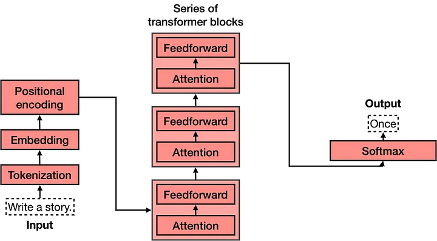
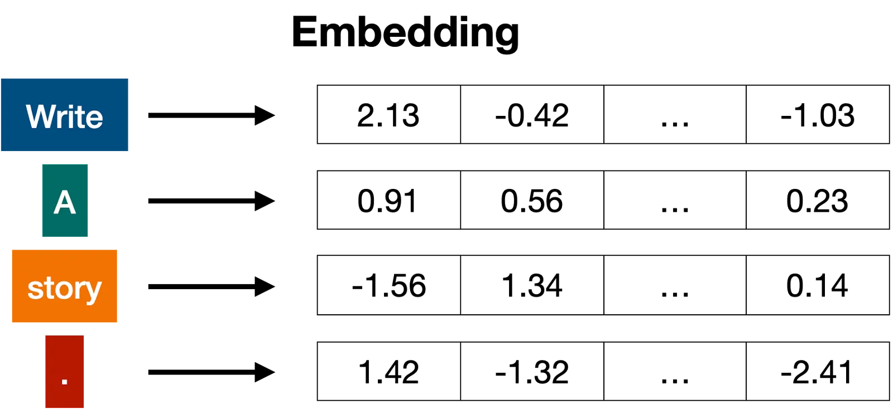
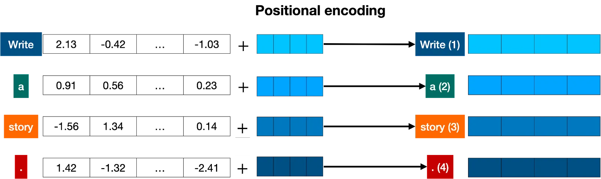
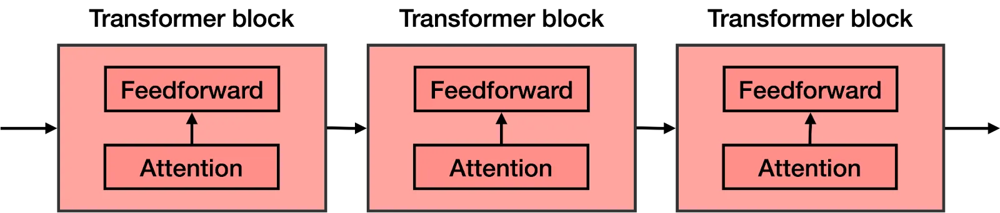
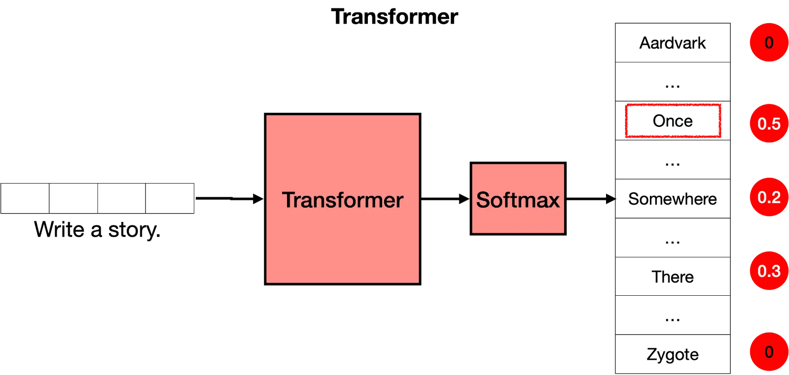

## What are Transformers?
- transformers are so incredibly good at keeping track of the context, that the next word they pick is exactly what it needs to keep going with an idea.
- Transformers are very good in keeping track of context
- Transformers have 4 main parts:
    - Tokenization
    - Embedding
    - Positional encoding
    - Transformer block (several of these)
    - Softmax

### 1.Tokenization: 

The tokenization step takes every word, prefix, suffix, and punctuation signs, and sends them to a known token from the library. 

### 2. Embbedding:

- After Input is tokenized it has to be transformed into numbers.
-  If two pieces of text are similar, then the numbers in their corresponding vectors are similar to each other (componentwise, meaning each pair of numbers in the same position are similar). Otherwise, if two pieces of text are different, then the numbers in their corresponding vectors are different.  

### 3. Positional Encoding:
- Once we have the vectors corresponding to each of the tokens in the sentence, the next step is to turn all these into one vector to process. 
- Positional encoding consists of adding a sequence of predefined vectors to the embedding vectors of the words. This ensures we get a unique vector for every sentence, and sentences with the same words in different order will be assigned different vectors.

### 4. Transformer Block: 
- The words come in and get turned into tokens (tokenization), tokenized words are turned into numbers (embeddings), then order gets taken into account (positional encoding).
- next step is to predict the next word in this sentence. This is done with a really really large neural network, which is trained precisely with that goal, to predict the next word in a sentence.
- The attention component is added at every block of the feedforward network. Therefore, if you imagine a large feedforward neural network whose goal is to predict the next word, formed by several blocks of smaller neural networks, an attention component is added to each one of these blocks.

### 5. Attention: 
- Attention mechanism deals with a very important problem which is the problem of context.
- Attention is a very useful technique that helps language models understand the context.

- The attention step used in transformer models is actually much more powerful, and it’s called multi-head attention. 
- In multi-head attention, several different embeddings are used to modify the vectors and add context to them. Multi-head attention has helped language models reach much higher levels of efficacy when processing and generating text.

### 6. The Softmax Layer:
- The transformer outputs scores for all the words, where the highest scores are given to the words that are most likely to be next in the sentence.
- The last step of a transformer is a softmax layer, which turns these scores into probabilities (that add to 1), where the highest scores correspond to the highest probabilities.

## Resources:
- [Transformer Architecture explained](https://medium.com/@amanatulla1606/transformer-architecture-explained-2c49e2257b4c)
- [Introduction to Large Language Models and the Transformer Architecture](https://rpradeepmenon.medium.com/introduction-to-large-language-models-and-the-transformer-architecture-534408ed7e61)