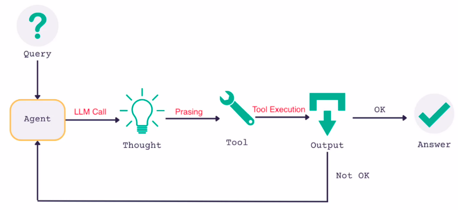
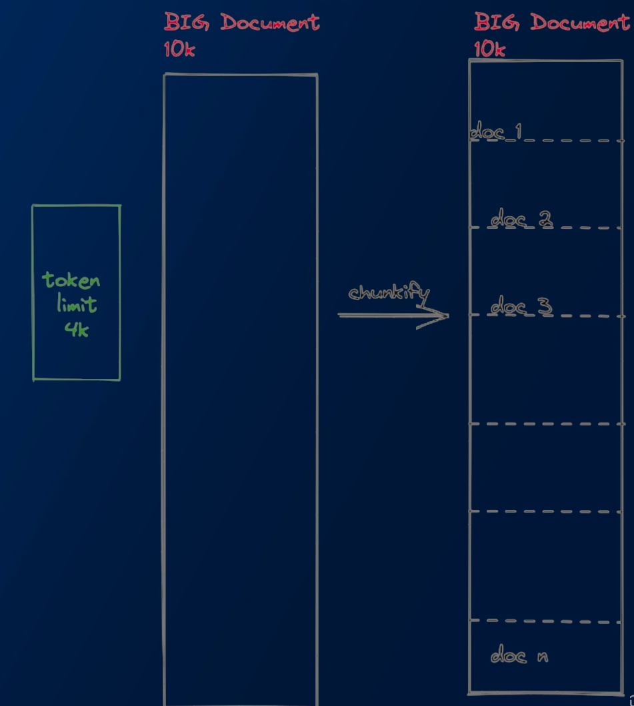
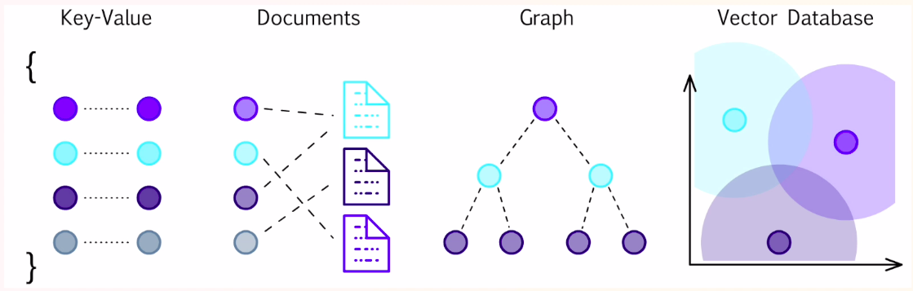
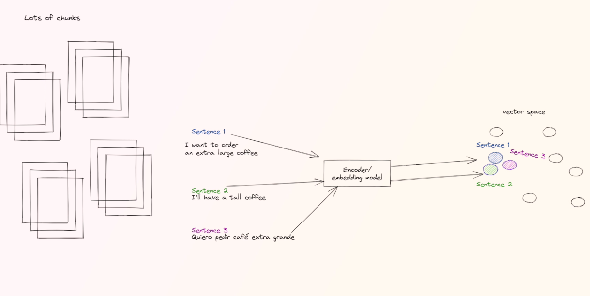
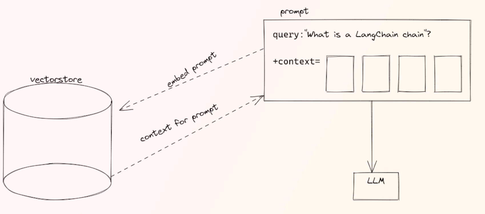

## Chat Models
- Chat Models are a core component of LangChain. Langchain provides a standard interface for interacting with many different models.
- There are a lot of Model providers (OpenAI, Cohere, Hugging Face ..) - the `chatModel` class is designed to provide a standard interface for all of them.

## Agents
- The idea of agents is to use a language model to choose what sequence of action to take. The language model is used as a reasoning engine to determine which actions to take and in which order.
- Agents are only as good as the tools they have.
- Agent is what we get when we combine Language model with tools.

Agents take as input text and they are able to select what tools to use. 

- **Observation**: is the result of the an execution of the `Tool`
- **AgentAction**: this is a dataclass that represents the action an agent should take. it has a `tool` property which is the name of the tool to be invoked and a `tool_input` property.
- **AgentFinish**: this represents the final result from an Agent, when it is ready to return to the user. It contains a `return_values` key-value mapping, which contains the final agent output.
- **Intermediate Steps**: These represent previous agent actions and corresponding outputs from this current agent run.
- **Agent**: This is the chain responsible for deciding what step to take next. This is usually powered by Language model, a prompt and an output parser.
- **Agent Types**:
    - `zero-shot-react-description`: this agent uses the reAct framework to determine which tool to use based solely on the tools description. Any number of tools can be provided. this agent requires that a description is provided for each tool.
    - `react-docstore`: this agent uses react framework to interact with docstore. Two tools must be provided: a `search` tool and a `lookup` tool. The `search` tool should seaerch for a document, while the lookup tool should lookup a term in the most recently found document.
- **Agent Executor**: is the runtime for an agent. This is what actually calls the agent, executes the actions it chooses, passes action outputs back to the agent and repeats.
- **Tools**: functions that an agent can invoke. The tool abstraction consists of two components:
    - The input schema for the tool. This tells the LLM what parameters are needed to call the tool. Without this, it will not know what the correct inputs are. These parameters should be sensibly named and described.
    - The function to run. This is generally just a Python function that is invoked.
- There are two important design considerations around tools:
    - Giving the agent access to the right tools
    - Describing the tools in a way that is most helpful to the agent

### Output Parsers:
- Output parser is used when you want to get more structured information than just text back. This is where output parsers come in.
### Callback Handler
- `CallbackHandlers` are objects that implement the `CallbackHandler` interface, which has a method for each event that can be subscribed to. The `CallBackManager` will call the appropriate method on each handler when the event is triggered
### Steps:
1. Creating a Custom Tool   
2. Using a Langchain Agent
3. Chaining
### Langchain Token Limitation Answers:
1. Stuffing
2. MapReduce
3. Refine
4. Map-Rerank
### Langchain Document Loaders:
- Use Document Loaders to load data from sources as Documents. A document is a piece of text and associated metadata. For example, there are document loaders for loading a simple `.txt` file,for loading the text contents of any we page, or even for loading a transcript of a youtube video.
- When dealing with large documents, it is important to split it into chunks.

### Text Splitters
- **Text splitters**: When splitting text, ideally you ant to keep semantically related pieces of text together. `Semantically related` means could depend on the type of text.
- Splitters work as follows:
    1. Split the text up into small, semantically meaningful chunks(often sentences)
    2. Start combining these small chunks into a larger chunk untill you reach a certain size (as measured by some function)
    3. Once you reach that size, make that chunk its own piece of text and then start creating a new chunk of text with some overlap (to keep context between chunks)
- **Retrieveal Augementation Generation RAG**: We take our original prompt and augemented with some relevant context and that way the llm is able to answer the original query.
- We cannot send all the chunks to the LLM, that is why we need to only send relevant chunks which saves a lot of ressources.
 
### Embeddings:
- Create a vector space from the text such as distance between vectors has a meaning. 

- We have to create a lot of chunks and then embed them to represent each chunk with a vector

- How it Works?

    - We embed the query and then send the embed prompt to the vectorstore to compare it with similar prompts. Then we retrieve the list of similar vectores as a new context for prompt.